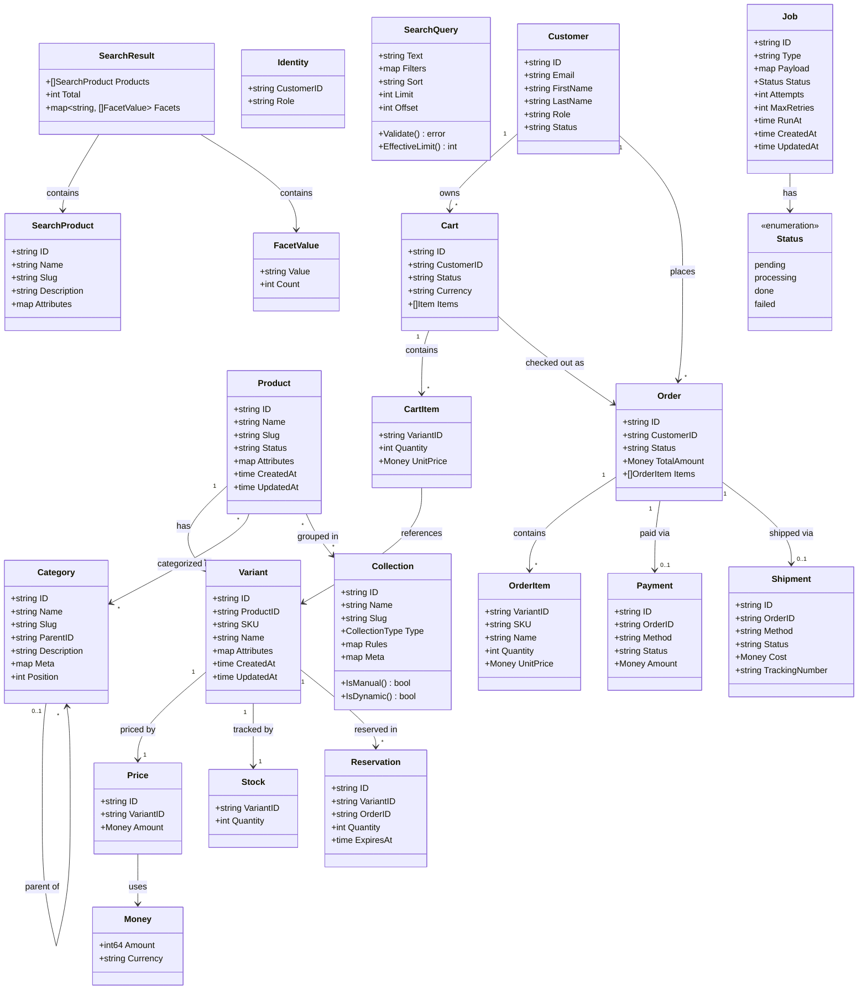

# C4 Level 4 — Code Diagram

Shows the domain model entities, their relationships, and the hexagonal port/adapter boundaries.

## Domain Entities & Relationships

## Hexagonal Architecture — Ports & Adapters

```mermaid
classDiagram
    direction LR

    class ProductRepository {
        <<interface>>
        +FindByID(ctx, id) Product
        +FindBySlug(ctx, slug) Product
        +List(ctx, offset, limit) []Product
        +FindByCategoryID(ctx, catID, offset, limit) []Product
        +Create(ctx, product) error
        +Update(ctx, product) error
        +WithTx(tx) ProductRepository
    }

    class CartRepository {
        <<interface>>
        +FindByID(ctx, id) Cart
        +FindActiveByCustomerID(ctx, custID) Cart
        +Save(ctx, cart) error
        +Delete(ctx, id) error
    }

    class OrderRepository {
        <<interface>>
        +FindByID(ctx, id) Order
        +FindByCustomerID(ctx, customerID) []Order
        +List(ctx, offset, limit) []Order
        +Save(ctx, order) error
        +UpdateStatus(ctx, order) error
    }

    class CategoryRepository {
        <<interface>>
        +FindByID(ctx, id) Category
        +FindBySlug(ctx, slug) Category
        +FindAll(ctx) []Category
        +Create(ctx, cat) error
        +Update(ctx, cat) error
    }

    class CollectionRepository {
        <<interface>>
        +FindByID(ctx, id) Collection
        +FindBySlug(ctx, slug) Collection
        +List(ctx, offset, limit) []Collection
        +Create(ctx, coll) error
        +Update(ctx, coll) error
        +AddProduct(ctx, collID, productID) error
        +RemoveProduct(ctx, collID, productID) error
        +ListProductIDs(ctx, collID) []string
    }

    class PricingStep {
        <<interface>>
        +Name() string
        +Apply(ctx, *PricingContext) error
    }

    class Step {
        <<interface>>
        +Name() string
        +Execute(ctx *Context) error
    }

    class Plugin {
        <<interface>>
        +Name() string
        +Init(app) error
    }

    class SearchEngine {
        <<interface>>
        +Name() string
        +IndexProduct(ctx, product) error
        +RemoveProduct(ctx, productID) error
        +Search(ctx, query) ~SearchResult, error~
    }

    class Queue {
        <<interface>>
        +Enqueue(ctx, job) error
        +Dequeue(ctx) ~*Job, error~
        +Complete(ctx, jobID) error
        +Fail(ctx, jobID, jobErr) error
    }

    class Handler {
        <<interface>>
        +Type() string
        +Handle(ctx, job) error
    }

    class Worker {
        -queue Queue
        -handlers map
        -log Logger
        -pollInterval Duration
        +Register(h Handler)
        +Start(ctx)
        +Stop()
    }

    class Scheduler {
        <<interface>>
        +Register(name, spec, fn)
        +Start(ctx)
        +Stop()
    }

    class Mailer {
        <<interface>>
        +Send(ctx, msg) error
    }

    class Message {
        +string To
        +string Subject
        +string Body
    }

    class Templates {
        -tmpls map
        +Register(name, subject, body)
        +Render(name, to, data) (Message, error)
    }

    class PostgresProductRepo {
        -db *sql.DB
    }
    class PostgresCartRepo {
        -db *sql.DB
    }
    class PostgresOrderRepo {
        -db *sql.DB
    }
    class PostgresCategoryRepo {
        -db *sql.DB
    }
    class PostgresCollectionRepo {
        -db *sql.DB
    }
    class ManualPayProvider {
    }
    class FlatRateShipProvider {
        -cost Money
    }
    class BasePriceStep {
        -prices PriceRepository
    }
    class PostgresSearchEngine {
        -db *sql.DB
    }
    class JobQueue {
        -db *sql.DB
    }
    class CronScheduler {
        -entries []entry
        -log Logger
    }
    class SMTPMailer {
        -cfg Config
    }
    class SearchHandler {
        -engine SearchEngine
        +Search() HandlerFunc
    }

    ProductRepository <|.. PostgresProductRepo : implements
    CartRepository <|.. PostgresCartRepo : implements
    OrderRepository <|.. PostgresOrderRepo : implements
    CategoryRepository <|.. PostgresCategoryRepo : implements
    CollectionRepository <|.. PostgresCollectionRepo : implements
    SearchEngine <|.. PostgresSearchEngine : implements
    Queue <|.. JobQueue : implements
    Scheduler <|.. CronScheduler : implements
    Mailer <|.. SMTPMailer : implements
    Templates --> Message : produces
    PricingStep <|.. BasePriceStep : implements
    SearchHandler --> SearchEngine : uses
    Worker --> Queue : polls
    Worker --> Handler : dispatches to
```

