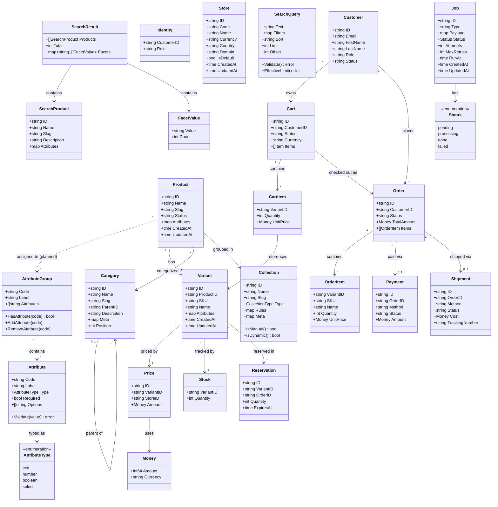

# C4 Level 4 — Code Diagram

Shows the domain model entities, their relationships, and the hexagonal port/adapter boundaries.

## Domain Entities & Relationships

```mermaid
classDiagram
    direction TB

    class Product {
        +string ID
        +string Name
        +string Slug
        +string Status
        +map Attributes
        +time CreatedAt
        +time UpdatedAt
    }

    class Variant {
        +string ID
        +string ProductID
        +string SKU
        +string Name
        +map Attributes
        +time CreatedAt
        +time UpdatedAt
    }

    class Price {
        +string ID
        +string VariantID
        +string StoreID
        +Money Amount
    }

    class Money {
        +int64 Amount
        +string Currency
    }

    class Category {
        +string ID
        +string Name
        +string Slug
        +string ParentID
        +string Description
        +map Meta
        +int Position
    }

    class Collection {
        +string ID
        +string Name
        +string Slug
        +CollectionType Type
        +map Rules
        +map Meta
        +IsManual() bool
        +IsDynamic() bool
    }

    class Cart {
        +string ID
        +string CustomerID
        +string Status
        +string Currency
        +[]Item Items
    }

    class CartItem {
        +string VariantID
        +int Quantity
        +Money UnitPrice
    }

    class Order {
        +string ID
        +string CustomerID
        +string Status
        +Money TotalAmount
        +[]OrderItem Items
    }

    class OrderItem {
        +string VariantID
        +string SKU
        +string Name
        +int Quantity
        +Money UnitPrice
    }

    class Customer {
        +string ID
        +string Email
        +string FirstName
        +string LastName
        +string Role
        +string Status
    }

    class Stock {
        +string VariantID
        +int Quantity
    }

    class Reservation {
        +string ID
        +string VariantID
        +string OrderID
        +int Quantity
        +time ExpiresAt
    }

    class Payment {
        +string ID
        +string OrderID
        +string Method
        +string Status
        +Money Amount
    }

    class Shipment {
        +string ID
        +string OrderID
        +string Method
        +string Status
        +Money Cost
        +string TrackingNumber
    }

    class Identity {
        +string CustomerID
        +string Role
    }

    class Store {
        +string ID
        +string Code
        +string Name
        +string Currency
        +string Country
        +string Domain
        +bool IsDefault
        +time CreatedAt
        +time UpdatedAt
    }

    class SearchQuery {
        +string Text
        +map Filters
        +string Sort
        +int Limit
        +int Offset
        +Validate() error
        +EffectiveLimit() int
    }

    class SearchResult {
        +[]SearchProduct Products
        +int Total
        +map~string, []FacetValue~ Facets
    }

    class FacetValue {
        +string Value
        +int Count
    }

    class SearchProduct {
        +string ID
        +string Name
        +string Slug
        +string Description
        +map Attributes
    }

    class Job {
        +string ID
        +string Type
        +map Payload
        +Status Status
        +int Attempts
        +int MaxRetries
        +time RunAt
        +time CreatedAt
        +time UpdatedAt
    }

    class Status {
        <<enumeration>>
        pending
        processing
        done
        failed
    }

    class Attribute {
        +string Code
        +string Label
        +AttributeType Type
        +bool Required
        +[]string Options
        +Validate(value) error
    }

    class AttributeType {
        <<enumeration>>
        text
        number
        boolean
        select
    }

    class AttributeGroup {
        +string Code
        +string Label
        +[]string Attributes
        +HasAttribute(code) bool
        +AddAttribute(code)
        +RemoveAttribute(code)
    }

    Attribute --> AttributeType : typed as
    AttributeGroup "*" --> "*" Attribute : contains
    Product "*" ..> "*" AttributeGroup : assigned to (planned)

    Job --> Status : has

    Product "1" --> "*" Variant : has
    Variant "1" --> "1" Price : priced by
    Variant "1" --> "1" Stock : tracked by
    Variant "1" --> "*" Reservation : reserved in
    Product "*" --> "*" Category : categorized in
    Product "*" --> "*" Collection : grouped in
    Category "0..1" --> "*" Category : parent of
    SearchResult --> SearchProduct : contains
    SearchResult --> FacetValue : contains
    Price --> Money : uses
    Cart "1" --> "*" CartItem : contains
    CartItem --> Variant : references
    Order "1" --> "*" OrderItem : contains
    Order "1" --> "0..1" Payment : paid via
    Order "1" --> "0..1" Shipment : shipped via
    Customer "1" --> "*" Cart : owns
    Customer "1" --> "*" Order : places
    Cart --> Order : checked out as
```

## Hexagonal Architecture — Ports & Adapters

```mermaid
classDiagram
    direction LR

    class ProductRepository {
        <<interface>>
        +FindByID(ctx, id) Product
        +FindBySlug(ctx, slug) Product
        +List(ctx, offset, limit) []Product
        +FindByCategoryID(ctx, catID, offset, limit) []Product
        +Create(ctx, product) error
        +Update(ctx, product) error
        +WithTx(tx) ProductRepository
    }

    class CartRepository {
        <<interface>>
        +FindByID(ctx, id) Cart
        +FindActiveByCustomerID(ctx, custID) Cart
        +Save(ctx, cart) error
        +Delete(ctx, id) error
    }

    class OrderRepository {
        <<interface>>
        +FindByID(ctx, id) Order
        +FindByCustomerID(ctx, customerID) []Order
        +List(ctx, offset, limit) []Order
        +Save(ctx, order) error
        +UpdateStatus(ctx, order) error
    }

    class CategoryRepository {
        <<interface>>
        +FindByID(ctx, id) Category
        +FindBySlug(ctx, slug) Category
        +FindAll(ctx) []Category
        +Create(ctx, cat) error
        +Update(ctx, cat) error
    }

    class CollectionRepository {
        <<interface>>
        +FindByID(ctx, id) Collection
        +FindBySlug(ctx, slug) Collection
        +List(ctx, offset, limit) []Collection
        +Create(ctx, coll) error
        +Update(ctx, coll) error
        +AddProduct(ctx, collID, productID) error
        +RemoveProduct(ctx, collID, productID) error
        +ListProductIDs(ctx, collID) []string
    }

    class PricingStep {
        <<interface>>
        +Name() string
        +Apply(ctx, *PricingContext) error
    }

    class Step {
        <<interface>>
        +Name() string
        +Execute(ctx *Context) error
    }

    class Plugin {
        <<interface>>
        +Name() string
        +Init(app) error
    }

    class SearchEngine {
        <<interface>>
        +Name() string
        +IndexProduct(ctx, product) error
        +RemoveProduct(ctx, productID) error
        +Search(ctx, query) ~SearchResult, error~
    }

    class Queue {
        <<interface>>
        +Enqueue(ctx, job) error
        +Dequeue(ctx) ~*Job, error~
        +Complete(ctx, jobID) error
        +Fail(ctx, jobID, jobErr) error
    }

    class Handler {
        <<interface>>
        +Type() string
        +Handle(ctx, job) error
    }

    class Worker {
        -queue Queue
        -handlers map
        -log Logger
        -pollInterval Duration
        +Register(h Handler)
        +Start(ctx)
        +Stop()
    }

    class Scheduler {
        <<interface>>
        +Register(name, spec, fn)
        +Start(ctx)
        +Stop()
    }

    class Mailer {
        <<interface>>
        +Send(ctx, msg) error
    }

    class Message {
        +string To
        +string Subject
        +string Body
    }

    class Templates {
        -tmpls map
        +Register(name, subject, body)
        +Render(name, to, data) (Message, error)
    }

    class PostgresProductRepo {
        -db *sql.DB
    }
    class PostgresCartRepo {
        -db *sql.DB
    }
    class PostgresOrderRepo {
        -db *sql.DB
    }
    class PostgresCategoryRepo {
        -db *sql.DB
    }
    class PostgresCollectionRepo {
        -db *sql.DB
    }
    class ManualPayProvider {
    }
    class FlatRateShipProvider {
        -cost Money
    }
    class BasePriceStep {
        -prices PriceRepository
    }
    class PostgresSearchEngine {
        -db *sql.DB
    }
    class JobQueue {
        -db *sql.DB
    }
    class CronScheduler {
        -entries []entry
        -log Logger
    }
    class SMTPMailer {
        -cfg Config
    }
    class Asset {
        +string ID
        +string Path
        +string Filename
        +string MimeType
        +int64 Size
        +map Meta
        +time CreatedAt
    }
    class Storage {
        <<interface>>
        +Name() string
        +Save(path, file) error
        +Delete(path) error
        +URL(path) string
    }
    class LocalStorage {
        -basePath string
        -baseURL string
    }
    class AssetRepository {
        <<interface>>
        +Save(ctx, asset) error
        +FindByID(ctx, id) Asset
    }
    class PostgresAssetRepo {
        -db *sql.DB
    }
    class Cache {
        <<interface>>
        +Get(key, dest) ~bool, error~
        +Set(key, value, ttl) error
        +Delete(key) error
    }
    class PostgresCacheStore {
        -db *sql.DB
        +DeleteExpired() ~int64, error~
    }
    class ConfigRepository {
        <<interface>>
        +Get(ctx, key) ~interface{}, error~
        +Set(ctx, key, value) error
        +Delete(ctx, key) error
        +All(ctx) ~[]Entry, error~
    }
    class PostgresConfigRepo {
        -db *sql.DB
    }
    class NotificationService {
        -templates Templates
        -customers CustomerRepository
        -orders OrderRepository
        -queue Queue
        +HandleOrderPaid(ctx, evt) error
    }
    class EmailSendHandler {
        -mailer Mailer
        +Type() string
        +Handle(ctx, job) error
    }
    class CacheCleanupHandler {
        -deleter ExpiredDeleter
        -log Logger
        +Type() string
        +Handle(ctx, job) error
    }
    class AttributeRegistry {
        -attrs map~string, Attribute~
        -groups map~string, AttributeGroup~
        +RegisterAttribute(attr)
        +Attribute(code) ~Attribute, bool~
        +Attributes() []Attribute
        +RegisterGroup(group) error
        +Group(code) ~AttributeGroup, bool~
        +Groups() []AttributeGroup
        +GroupAttributes(groupCode) ~[]Attribute, error~
        +ValidateAttributes(groupCode, values) []error
    }

    AttributeRegistry --> Attribute : manages
    AttributeRegistry --> AttributeGroup : manages

    class AdminRegistry {
        -forms map~string, *Form~
        -grids map~string, *Grid~
        +RegisterForm(name, form)
        +RegisterFormField(formName, field) error
        +RegisterGrid(name, grid)
        +RegisterGridColumn(gridName, column) error
        +RegisterAction(gridName, action) error
        +Form(name) ~Form, bool~
        +Grid(name) ~Grid, bool~
    }
    class Form {
        +string Name
        +[]Field Fields
    }
    class Field {
        +string Name
        +string Type
        +string Label
        +bool Required
        +interface{} Default
        +[]Option Options
        +map Meta
    }
    class Grid {
        +string Name
        +[]Column Columns
        +[]Action Actions
    }
    class Column {
        +string Name
        +string Label
        +func Value
        +map Meta
    }
    class Action {
        +string Name
        +string Label
        +func Execute
    }
    class StoreRepository {
        <<interface>>
        +FindByID(ctx, id) Store
        +FindByCode(ctx, code) Store
        +FindByDomain(ctx, domain) Store
        +FindDefault(ctx) Store
        +FindAll(ctx) []Store
        +Create(ctx, store) error
        +Update(ctx, store) error
    }
    class PostgresStoreRepo {
        -db *sql.DB
    }
    class StoreAdminHandler {
        -repo StoreRepository
        -bus *EventBus
        +List() HandlerFunc
        +Create() HandlerFunc
        +Update() HandlerFunc
    }
    class StoreMiddleware {
        <<middleware>>
        -repo StoreRepository
        +ServeHTTP(w, r)
    }
    class RateLimitMiddleware {
        <<middleware>>
        -defaultLimiter *Limiter
        -routeLimiters []routeLimiter
        +ServeHTTP(w, r)
    }
    class Limiter {
        -mu sync.Mutex
        -buckets map~string, *bucket~
        -rate float64
        -burst int
        +NewLimiter(rate, burst) *Limiter
        +Allow(key) bool
    }

    class SearchHandler {
        -engine SearchEngine
        +Search() HandlerFunc
    }
    class SchemaHandler {
        -registry *AdminRegistry
        +GetForm() HandlerFunc
        +GetGrid() HandlerFunc
    }
    class StorefrontHandler {
        -engine *ThemeEngine
        -repo ProductRepository
        -pdp *Pipeline~ProductContext~
        +Product() HandlerFunc
    }
    class ThemeEngine {
        <<theme.Engine>>
        -theme Theme
        -pages map~string, *Template~
        +Theme() Theme
        +Render(w, name, data) error
        +HasTemplate(name) bool
    }
    note for ThemeEngine "theme.Load(dir string) (*Engine, error)\nPackage-level constructor"
    class Theme {
        +string Name
        +string Version
    }

    ProductRepository <|.. PostgresProductRepo : implements
    CartRepository <|.. PostgresCartRepo : implements
    OrderRepository <|.. PostgresOrderRepo : implements
    CategoryRepository <|.. PostgresCategoryRepo : implements
    CollectionRepository <|.. PostgresCollectionRepo : implements
    SearchEngine <|.. PostgresSearchEngine : implements
    Queue <|.. JobQueue : implements
    Scheduler <|.. CronScheduler : implements
    Mailer <|.. SMTPMailer : implements
    Storage <|.. LocalStorage : implements
    AssetRepository <|.. PostgresAssetRepo : implements
    Cache <|.. PostgresCacheStore : implements
    StoreRepository <|.. PostgresStoreRepo : implements
    StoreAdminHandler --> StoreRepository : uses
    StoreMiddleware --> StoreRepository : resolves store by domain
    StoreMiddleware --> StoreAdminHandler : passes resolved store context
    RateLimitMiddleware --> Limiter : checks per-IP token buckets
    ConfigRepository <|.. PostgresConfigRepo : implements
    Templates --> Message : produces
    PricingStep <|.. BasePriceStep : implements
    SearchHandler --> SearchEngine : uses
    SchemaHandler --> AdminRegistry : reads schemas
    StorefrontHandler --> ThemeEngine : renders pages
    StorefrontHandler --> ProductRepository : looks up by slug
    ThemeEngine --> Theme : holds metadata
    Worker --> Queue : polls
    Worker --> Handler : dispatches to
    Handler <|.. EmailSendHandler : implements
    Handler <|.. CacheCleanupHandler : implements
    CacheCleanupHandler --> PostgresCacheStore : calls DeleteExpired
    AdminRegistry --> Form : manages
    AdminRegistry --> Grid : manages
    Form --> Field : contains
    Grid --> Column : contains
    Grid --> Action : contains
    EmailSendHandler --> Mailer : sends via
    NotificationService --> Templates : renders
    NotificationService --> Queue : enqueues email.send
```

**Composition root (PR-1013):** HTTP serve wiring lives in `cmd/api` as `wire_repos.go` (postgres repos), `wire_services.go` (plugins, pipelines, handlers, events), and `wire_routes.go` (middleware + routes + `MountProbes`). `runServe` in `main.go` only opens the DB and starts/stops the server, worker, and optional embedded scheduler.

**CLI IO composition (PR-1014):** CSV `import:*` / `export:*` commands share `runIOCommand` in `io_command.go` (DB open, file open/atomic write, optional import/export row-hook bootstrap, row-error logging). Per-entity logic stays in thin hooks in `io_commands.go`; `config:import` / `config:export` are separate.

**HTTP package layout (PR-1021):** Cross-cutting primitives with no handler-specific dependencies — `Router`/`Middleware`, response envelope (`JSON`/`JSONError`), `ParsePagination`, `Server`, and generic middleware (security headers, body limit, cache, rate limit, CSRF, language, store resolution, URL-rewrite resolution, Prometheus metrics) — moved to `internal/interfaces/http/shared`. This gives PR-1022 (admin handler split) and PR-1023 (storefront handler split) a dependency-free base package to import without risking an import cycle through `internal/interfaces/http`. `internal/interfaces/http` re-exports the same names via `shared_compat.go` (type aliases + thin forwarders) so none of its ~170 existing handler/test files needed to change in this PR; `AuthMiddleware` stayed in `internal/interfaces/http` at the time because it depended on storefront session-cookie helpers that were still handler-owned (resolved in PR-1023, see below). All handlers, routes, and URLs are unchanged.

**Admin package split (PR-1022):** Every admin-privileged HTTP handler — the `*_admin.go` files plus `media.go`, `schema_handler.go`, `refund.go` (moved a PR late, in PR-1023, once the naming-convention gap was noticed), and the `admin_*.go` identity/MFA/role/scope/user helpers, which were admin-only despite not matching the `_admin.go` suffix — moved to `internal/interfaces/http/admin`, a new adapter package alongside `shared`. `store_credit.go` was split: the admin handler moved, the customer-facing account handler stayed. New admin code imports `shared` directly (no shim). `cmd/api` wiring now constructs these handlers from `admin` instead of `http`. No route, permission, or response-shape changes.

**Storefront package split (PR-1023):** Every customer-facing handler (REST API + SSR views) moved to `internal/interfaces/http/storefront`, the same way admin did in PR-1022 — including `sitemap.go`/`robots.go` (public SEO surface) and `rewrite_handler.go` (companion to `ResolverMiddleware`, which already lived in `shared`). This PR also finished the `auth_middleware.go` split PR-1021/1022 had deferred: `AuthMiddleware`/`RequireAuth` (customer JWT, coupled to a storefront session-cookie helper) moved to `storefront`; `RequirePermission`/`RequireRole`/`AdminContextMiddleware` (pure RBAC, zero storefront coupling, used exclusively to gate `/api/v1/admin/*`) moved to `admin` instead. `admin` now imports the handful of response-shaping helpers it shares with storefront (`AccountDeleter`, `OrderResponse`/`ToOrderResponse`, `ToReturnResponse(s)`, `ToAdminReviewResponse(s)`, `CategoryHandler`, `VariantHandler`) from `storefront` rather than the legacy `http` package. What's left in `internal/interfaces/http` is genuinely neither admin nor storefront: `docs.go`, `health.go`, `setup.go`, `payment_webhook.go`, `stripe_webhook.go`, and the `shared_compat.go` shim they still use. No route, permission, or response-shape changes.

**OpenTelemetry tracing (PR-1024):** New `internal/platform/tracing` package (`Setup`/`Shutdown`) installs an OTLP/HTTP exporter as the global OTel `TracerProvider` when `tracing.enabled` — otherwise every `otel.Tracer(...)` call anywhere in the process resolves to OTel's own no-op tracer, so instrumentation never needs its own enabled-check or nil-guard (unlike the `metrics.Recorder` interface's `Noop()`, tracing needed no equivalent construct in this codebase). `shared.TracingMiddleware` (new, alongside `MetricsMiddleware` in `internal/interfaces/http/shared`) starts one span per HTTP request and reads the matched route template from the same `*routeMatch` context box `MetricsMiddleware` already reads (see PR-1023's CR-follow-up round) rather than re-deriving it. `checkout.Workflow.Execute` gets a root span plus one child span per step. Both `TracingMiddleware` and `checkout.NewWorkflow` resolve their `Tracer` handle at construction time (once per process, in `cmd/api`'s wiring) rather than caching one in a package variable — OTel's global provider only migrates a pre-existing handle to a newly-installed SDK provider once, so a handle obtained before `tracing.Setup` runs would otherwise never see the real provider. DB query spans are deferred: no shared `*sql.DB` access wrapper exists across the ~40 postgres repo files to hang them on.
