# C4 Level 3 — Component Diagram

Shows the internal components of the API Server container, organized by hexagonal architecture layers.

```mermaid
C4Component
    title Shopanda API Server — Component Diagram

    ContainerDb(postgres, "PostgreSQL", "Database")
    System_Ext(paymentGateway, "Payment Gateway", "External")

    Container_Boundary(api, "API Server") {

        Component(middleware, "Middleware Chain", "Go net/http", "Recovery → RequestID → Logging → Auth. Wraps all routes.")

        Boundary(interfaces, "Interfaces Layer (HTTP Handlers)") {
            Component(authHandler, "AuthHandler", "HTTP", "Register, Login, Logout, Me, PasswordReset")
            Component(productHandler, "ProductHandler", "HTTP", "List, Get products (public)")
            Component(productAdmin, "ProductAdminHandler", "HTTP", "Create, Update products (admin)")
            Component(variantHandler, "VariantHandler", "HTTP", "CRUD variants")
            Component(cartHandler, "CartHandler", "HTTP", "Create, Get, AddItem, UpdateItem, RemoveItem")
            Component(checkoutHandler, "CheckoutHandler", "HTTP", "StartCheckout")
            Component(orderHandler, "OrderHandler", "HTTP", "List, Get orders")
            Component(orderAdmin, "OrderAdminHandler", "HTTP", "List, Get orders (admin)")
            Component(categoryHandler, "CategoryHandler", "HTTP", "Tree, Get, Products (public)")
            Component(searchHandler, "SearchHandler", "HTTP", "Full-text product search (public)")
            Component(mediaHandler, "MediaHandler", "HTTP", "Upload media files (admin)")
            Component(schemaHandler, "SchemaHandler", "HTTP", "Expose admin form and grid schemas (admin)")
            Component(shippingHandler, "ShippingRatesHandler", "HTTP", "List shipping rates")
            Component(webhookHandler, "PaymentWebhookHandler", "HTTP", "Handle payment callbacks (public)")
            Component(storefrontHandler, "StorefrontHandler", "HTTP", "SSR product page: slug lookup → PDP pipeline → theme render (optional, gated by frontend.enabled)")
        }

        Boundary(application, "Application Layer (Use Cases)") {
            Component(authService, "AuthService", "Go", "Register, Login, Logout, JWT validation, password reset")
            Component(cartService, "CartService", "Go", "Cart management with pricing integration")
            Component(checkoutWorkflow, "CheckoutWorkflow", "Go", "6-step ordered flow: validate → price → reserve → order → ship → pay")
            Component(pricingPipeline, "PricingPipeline", "Go", "Step-based price calculation: BasePriceStep → plugin steps → FinalizeStep")
            Component(compositionPipeline, "CompositionPipeline", "Go, Generics", "PDP and PLP response enrichment via plugin steps")
            Component(importerService, "ProductImporter", "Go", "Bulk CSV product import with attribute mapping and validation")
            Component(exporterService, "ProductExporter", "Go", "Paginated product/variant export to CSV with dynamic attribute columns")
            Component(stockImporter, "StockImporter", "Go", "CSV stock quantity import: SKU lookup, validation, bulk SetStock")
            Component(stockExporter, "StockExporter", "Go", "Paginated stock export to CSV with SKU resolution")
            Component(customerImporter, "CustomerImporter", "Go", "CSV customer import: email-keyed creation, role/status validation, password hashing")
            Component(customerExporter, "CustomerExporter", "Go", "Paginated customer export to CSV (email, name, role, status; no password hash)")
            Component(attrImporter, "AttributeImporter", "Go", "CSV attribute & group import: validates types, builds registry, persists to config store")
            Component(attrExporter, "AttributeExporter", "Go", "Exports attribute & group definitions from config store to CSV")
            Component(catImporter, "CategoryImporter", "Go", "CSV category import: topological sort, parent resolution, upsert")
            Component(catExporter, "CategoryExporter", "Go", "Exports category tree to CSV in parent-before-child order")
            Component(notifService, "NotificationService", "Go", "Listens to order.paid, renders email template, enqueues email.send job")
            Component(mediaService, "MediaService", "Go", "Upload files: validate type, save to storage, persist asset record")
            Component(cacheCleanupHandler, "CacheCleanupHandler", "Go", "Handles cache.cleanup jobs: removes expired cache entries")
            Component(productSchemaRegistration, "ProductSchemaRegistration", "Go", "Registers product form and grid schemas with admin registry")
        }

        Boundary(infrastructure, "Infrastructure Layer (Adapters)") {
            Component(postgresRepos, "PostgreSQL Repositories", "Go, lib/pq", "13 repo implementations: Product, Variant, Price, Cart, Order, Customer, Stock, Reservation, Payment, Shipping, Category, Collection, ResetToken")
            Component(postgresSearch, "PostgresSearchEngine", "Go, tsvector", "Full-text search via PostgreSQL tsvector, filters, facets")
            Component(postgresJobQueue, "PostgresJobQueue", "Go, lib/pq", "Job queue with FOR UPDATE SKIP LOCKED dequeue, retry logic")
            Component(manualPay, "ManualPayProvider", "Go", "Offline payment processing")
            Component(flatRate, "FlatRateShipProvider", "Go", "Fixed-cost shipping calculation")
            Component(cronScheduler, "CronScheduler", "Go", "In-process cron scheduler: implements Scheduler port, fires registered tasks on schedule, enqueues jobs into Queue")
            Component(smtpMailer, "SMTPMailer", "Go, net/smtp", "Sends email via SMTP: implements Mailer port")
            Component(localFSStorage, "LocalStorage", "Go, os", "Saves/deletes files on local disk: implements Storage port")
            Component(pgCacheStore, "PostgresCacheStore", "Go, UNLOGGED table", "Key-value cache with TTL: implements Cache port")
            Component(pgConfigRepo, "PostgresConfigRepo", "Go, lib/pq", "DB-backed config storage: implements config.Repository port")
        }

        Boundary(domain, "Domain Layer") {
            Component(jobWorker, "JobWorker", "Go", "Domain-layer worker: polls Queue port, dispatches jobs to registered handlers")
            Component(adminRegistry, "AdminSchemaRegistry", "Go", "In-memory registry of Form and Grid schemas; plugins append fields, columns, actions")
            Component(attributeRegistry, "AttributeRegistry", "Go", "In-memory registry of Attribute and AttributeGroup; typed validation of product attribute values")
            Component(themeEngine, "ThemeEngine", "Go, html/template", "Loads theme templates with layout support; renders pages via Render(name, data)")
        }

        Boundary(platform, "Platform Layer (Cross-Cutting)") {
            Component(eventBus, "EventBus", "Go", "Pub/sub for domain events (sync + async)")
            Component(pluginRegistry, "PluginRegistry", "Go", "Plugin lifecycle: register → init → collect steps")
            Component(jwtPkg, "JWT", "Go, crypto", "Token issuing and verification")
            Component(configPkg, "Config", "Go, yaml.v3", "YAML configuration loading")
            Component(loggerPkg, "Logger", "Go", "Structured logging (info, error, metadata)")
        }
    }

    Rel(middleware, authHandler, "Routes requests")
    Rel(middleware, productHandler, "Routes requests")
    Rel(middleware, cartHandler, "Routes requests")
    Rel(middleware, checkoutHandler, "Routes requests")
    Rel(middleware, categoryHandler, "Routes requests")
    Rel(middleware, searchHandler, "Routes requests")
    Rel(middleware, mediaHandler, "Routes requests")
    Rel(middleware, schemaHandler, "Routes requests")
    Rel(middleware, webhookHandler, "Routes requests")
    Rel(middleware, storefrontHandler, "Routes requests (when frontend.enabled)")

    Rel(authHandler, authService, "Delegates auth logic")
    Rel(cartHandler, cartService, "Delegates cart logic")
    Rel(checkoutHandler, checkoutWorkflow, "Delegates checkout flow")
    Rel(productHandler, compositionPipeline, "Enriches product responses")
    Rel(storefrontHandler, compositionPipeline, "Runs PDP pipeline")
    Rel(storefrontHandler, postgresRepos, "Product lookup by slug")
    Rel(storefrontHandler, themeEngine, "Renders product page template")

    Rel(cartService, pricingPipeline, "Prices cart items")
    Rel(checkoutWorkflow, pricingPipeline, "Recalculates pricing")
    Rel(checkoutWorkflow, manualPay, "Initiates payment")
    Rel(checkoutWorkflow, flatRate, "Selects shipping")
    Rel(checkoutWorkflow, eventBus, "Publishes checkout events")

    Rel(eventBus, notifService, "order.paid event")
    Rel(notifService, postgresRepos, "Looks up order + customer")
    Rel(notifService, postgresJobQueue, "Enqueues email.send job")
    Rel(jobWorker, smtpMailer, "EmailSendHandler sends via Mailer")
    Rel(jobWorker, cacheCleanupHandler, "Dispatches cache.cleanup jobs")
    Rel(cacheCleanupHandler, pgCacheStore, "Calls DeleteExpired")

    Rel(authService, postgresRepos, "Customer + token queries")
    Rel(cartService, postgresRepos, "Cart persistence")
    Rel(checkoutWorkflow, postgresRepos, "Order, inventory, payment, shipping persistence")
    Rel(productHandler, postgresRepos, "Product queries")
    Rel(pluginRegistry, adminRegistry, "Plugins register schemas")
    Rel(importerService, attributeRegistry, "Validates attribute values")
    Rel(exporterService, postgresRepos, "Reads products and variants")
    Rel(stockImporter, postgresRepos, "Looks up variants by SKU, writes stock entries")
    Rel(stockExporter, postgresRepos, "Lists stock entries, looks up variants by ID")
    Rel(customerImporter, postgresRepos, "Creates customer records")
    Rel(customerExporter, postgresRepos, "Lists customers with pagination")
    Rel(attrImporter, pgConfigRepo, "Persists attribute definitions")
    Rel(attrExporter, pgConfigRepo, "Reads attribute definitions")
    Rel(catImporter, postgresRepos, "Reads and writes categories")
    Rel(catExporter, postgresRepos, "Reads categories")
    Rel(productSchemaRegistration, adminRegistry, "Registers product form + grid")
    Rel(categoryHandler, postgresRepos, "Category + product queries")
    Rel(searchHandler, postgresSearch, "Delegates search queries")
    Rel(mediaHandler, mediaService, "Delegates upload logic")
    Rel(schemaHandler, adminRegistry, "Reads form and grid schemas")
    Rel(mediaService, localFSStorage, "Saves files")
    Rel(mediaService, postgresRepos, "Persists asset records")

    Rel(postgresRepos, postgres, "SQL queries", "lib/pq")
    Rel(postgresSearch, postgres, "Full-text search queries", "lib/pq")
    Rel(postgresJobQueue, postgres, "Job queue queries", "lib/pq")
    Rel(pgCacheStore, postgres, "Key-value cache queries", "lib/pq")
    Rel(pgConfigRepo, postgres, "Config key-value queries", "lib/pq")
    Rel(jobWorker, postgresJobQueue, "Polls and claims jobs")
    Rel(cronScheduler, postgresJobQueue, "Enqueues scheduled jobs")
    Rel(webhookHandler, paymentGateway, "Receives callbacks")
    Rel(pluginRegistry, pricingPipeline, "Provides pricing steps via pluginApp")
    Rel(pluginRegistry, checkoutWorkflow, "Provides checkout steps via pluginApp")
    Rel(pluginRegistry, compositionPipeline, "Provides composition steps via pluginApp")
    Rel(pluginRegistry, eventBus, "Provides event handlers via pluginApp")
```

> **Wiring note:** PluginRegistry calls `plugin.Init(pluginApp)` for each plugin.
> Plugins register steps/handlers into `pluginApp` during init.
> `main.go` then extracts those steps from `pluginApp` and wires them into
> the pipelines, workflows, and event bus — hexagonal-style explicit wiring,
> not direct injection by the registry.
