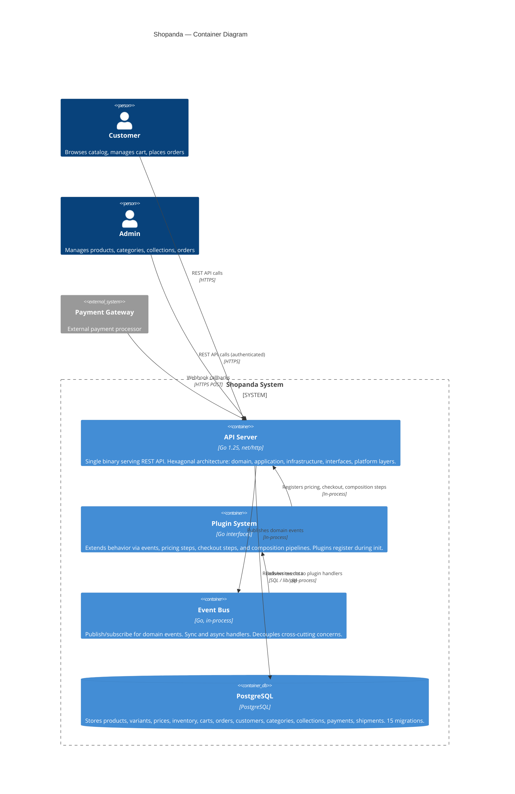

# C4 Level 2 — Container Diagram

Shows the major containers (deployable units) within the Shopanda system.

```mermaid
C4Container
    title Shopanda — Container Diagram

    Person(customer, "Customer", "Browses catalog, manages cart, places orders")
    Person(admin, "Admin", "Manages products, categories, collections, orders")
    System_Ext(paymentGateway, "Payment Gateway", "External payment processor")

    System_Boundary(shopanda, "Shopanda System") {
        Container(apiServer, "API Server", "Go 1.25, net/http", "Single binary serving REST API. Hexagonal architecture: domain, application, infrastructure, interfaces, platform layers.")
        Container(pluginSystem, "Plugin System", "Go interfaces", "Extends behavior via events, pricing steps, checkout steps, and composition pipelines. Plugins register during init.")
        Container(eventBus, "Event Bus", "Go, in-process", "Publish/subscribe for domain events. Sync and async handlers. Decouples cross-cutting concerns.")
        ContainerDb(postgres, "PostgreSQL", "PostgreSQL", "Stores products, variants, prices, inventory, carts, orders, customers, categories, collections, payments, shipments. 15 migrations.")
    }

    Rel(customer, apiServer, "REST API calls", "HTTPS")
    Rel(admin, apiServer, "REST API calls (authenticated)", "HTTPS")
    Rel(paymentGateway, apiServer, "Webhook callbacks", "HTTPS POST")
    Rel(apiServer, postgres, "Reads/writes data", "SQL / lib/pq")
    Rel(apiServer, eventBus, "Publishes domain events", "In-process")
    Rel(eventBus, pluginSystem, "Delivers events to plugin handlers", "In-process")
    Rel(pluginSystem, apiServer, "Registers pricing, checkout, composition steps", "In-process")

    UpdateRelStyle(customer, apiServer, $offsetY="-40")
    UpdateRelStyle(admin, apiServer, $offsetY="40")
```
