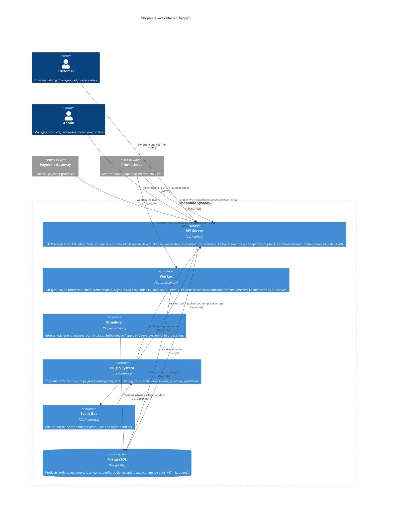

# C4 Level 2 — Container Diagram

Shows the major containers (deployable units) within the Shopanda system.

> **Runtime layout:** Development uses `app dev` (single process with embedded worker + scheduler). Production runs `serve`, `worker`, and `scheduler` as separate services from the same image. See [Runtime Modes](../phase-4-refactoring/specs/RUNTIME_MODES.md).
