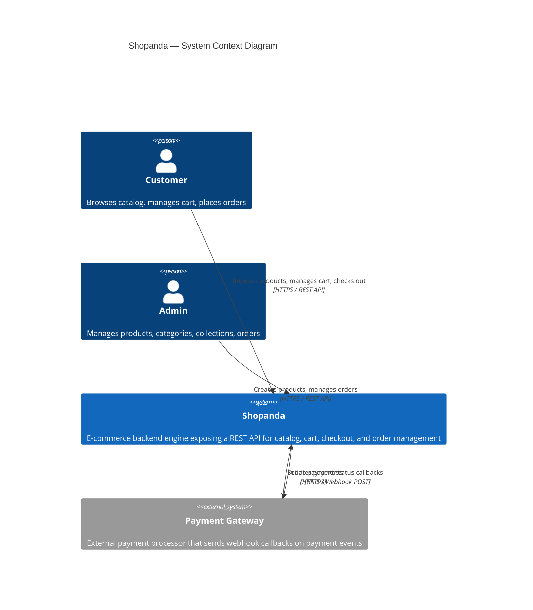

# C4 Level 1 — System Context

Shows Shopanda and its external actors/systems.

```mermaid
C4Context
    title Shopanda — System Context Diagram

    Person(customer, "Customer", "Browses catalog, manages cart, places orders")
    Person(admin, "Admin", "Manages products, categories, collections, orders")

    System(shopanda, "Shopanda", "E-commerce backend engine exposing a REST API for catalog, cart, checkout, and order management")

    System_Ext(paymentGateway, "Payment Gateway", "External payment processor that sends webhook callbacks on payment events")

    Rel(customer, shopanda, "Browses products, manages cart, checks out", "HTTPS / REST API")
    Rel(admin, shopanda, "Creates products, manages orders", "HTTPS / REST API")
    Rel(paymentGateway, shopanda, "Sends payment status callbacks", "HTTPS / Webhook POST")
    Rel(shopanda, paymentGateway, "Initiates payments", "HTTPS")

    UpdateRelStyle(customer, shopanda, $offsetY="-40")
    UpdateRelStyle(admin, shopanda, $offsetY="40")
```
