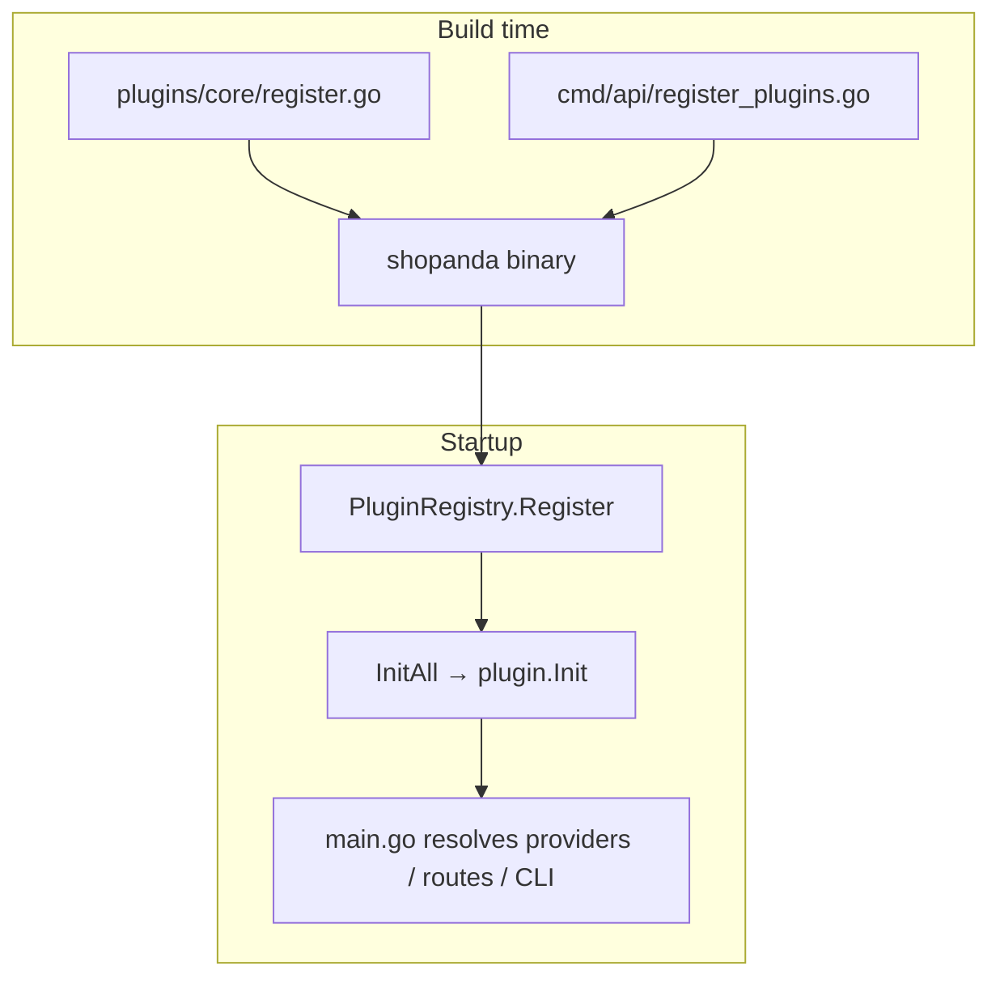

# Dynamic Plugin Loading — Research (PR-544)

**Status:** Research complete · **Verdict:** defer Go `.so` dynamic loading  
**Date:** Phase 5 (PR-544)  
**Audience:** integrators, core maintainers, operators

---

## Executive summary

Shopanda evaluated runtime plugin loading via Go's `plugin` package (`.so` / `.dylib` shared objects). **We are not implementing it.** Compile-time registration through `cmd/api/register_plugins.go` remains the supported extension model.

| Approach | Verdict |
| --- | --- |
| **Compile-time registration** (current) | **Keep** — default for OSS and external plugins |
| **Go `plugin.Open` (.so)** | **Defer** — toolchain fragility outweighs benefit for our use case |
| **Out-of-process plugins** (HTTP/gRPC sidecar) | **Future** — different product shape; not a drop-in for `.so` |
| **WASM sandbox** | **Future** — high effort; revisit only if untrusted third-party code is a goal |

---

## Context

Phase 4 deferred “plugin `.so` hot-loading.” Phase 5 Track E assigned PR-544 as an explicit **research gate** before any implementation work. Goals:

1. Confirm whether `.so` loading fits Shopanda's single-binary, self-hosted, GPL open-core model.
2. Document trade-offs for integrators who want “install a plugin without recompiling.”
3. Record what would need to change if the decision is revisited.

---

## Current model (shipped)



**Characteristics:**

- All plugins are **in-process**; they share memory and call domain/application ports through `plugin.App`.
- **Core plugins** (`plugins/core/`) register from driver switches (`search.engine`, `queue.driver`, …).
- **External plugins** register from `register_plugins.go` when enabled in config (e.g. `plugins.example.enabled`, `plugins.b2b.enabled`).
- Failed `Init` marks a plugin `failed` without crashing the process (`PluginRegistry.InitAll`).
- Extension surfaces: pricing/checkout/composition steps, events, permissions, admin routes, public routes, CLI commands, config fields.

This model shipped through Phase 5 (including PR-541 plugin CLI and PR-543 GraphQL public routes).

---

## Option A — Go `plugin` package (`.so`)

Go provides [`plugin.Open`](https://pkg.go.dev/plugin) to load shared objects at runtime. A `.so` would export a `Plugin` symbol implementing `plugin.Plugin`.

### Constraints (from Go runtime and ecosystem)

| Constraint | Impact on Shopanda |
| --- | --- |
| **Exact toolchain match** | Plugin `.so` must be built with the **same Go version**, **same build tags**, and compatible **build mode** as the main binary. Patch-level drift breaks loads. |
| **No unloading** | Loaded plugins cannot be removed; “hot reload” still requires process restart for safe state. |
| **OS support** | Linux and macOS only; **no Windows**. Shopanda targets self-hosted Linux heavily but Windows dev machines would be second-class. |
| **Symbol surface** | Only exported symbols are visible; shared types across main/plugin must live in **stable, versioned API packages** with zero duplicate package paths in the link graph. |
| **GPL linking** | Distributing proprietary `.so` plugins against GPL core raises **license compatibility** questions for a marketplace model. |
| **Operational coupling** | Operators must ship matching `.so` artifacts per Shopanda release; CI must build and test matrix (core version × plugin version). |

### Spike conclusion

A minimal spike (design review + toolchain checklist, no production loader) shows that `.so` loading does **not** remove the need for coordinated releases: integrators still need binaries built against a specific Shopanda version. The remaining benefit—“skip recompiling the main app when only the plugin changes”—is narrow compared to:

- Added crash risk (ABI/symbol mismatch → load panic)
- Harder support (“which Go version built this `.so`?”)
- Duplication of wiring already solved by `register_plugins.go` + config flags

**Verdict: defer.** Not rejected forever; rejected for Phase 5 scope and current product goals.

---

## Option B — Compile-time registration (current, recommended)

Integrators add a module import and one line in `register_plugins.go`:

```go
func registerPlugins(registry *plugin.Registry, cfg *config.Config) {
    core.Register(registry, cfg)
    if cfg.Plugins.Acme.Enabled {
        registry.Register(acme.New())
    }
}
```

**Pros:** deterministic builds, full type safety, simple CI, no OS-specific artifacts, aligns with hexagonal explicit wiring.

**Cons:** requires rebuild/redeploy to add a new external plugin (acceptable for self-hosted technical teams).

This is the **documented path** in [PLUGINS.md](../../../PLUGINS.md) and [Developer Guide](../../guides/DEVELOPER.md).

---

## Option C — Out-of-process plugins

Plugins run as separate services; core calls them via HTTP/gRPC/webhooks.

**Pros:** isolation, language-agnostic, clearer security boundary for untrusted code.

**Cons:** not in-process; latency and deployment complexity; does not map to existing `plugin.App` hooks without a new integration layer. Better suited to “integration partners” than “Shopanda plugins.”

**Verdict:** out of scope for replacing `.so`; consider only if a future **Integration SDK** (outbound/inbound HTTP) is productized separately.

---

## Option D — WASM sandbox

Run guest code in a WASM runtime with host imports for narrow APIs.

**Pros:** stronger sandbox than `.so`, potentially cross-platform.

**Cons:** large engineering effort; Go→WASM host ABI design; performance and debugging cost. No existing hooks in core.

**Verdict:** future research only.

---

## Decision matrix

| Criterion | Compile-time | Go `.so` | Out-of-process | WASM |
| --- | --- | --- | --- | --- |
| Type safety | High | Medium | Medium (schema) | Medium |
| Ops complexity | Low | High | High | Very high |
| Hot reload | No (restart) | No (no unload) | Partial | Partial |
| Windows dev UX | Good | Poor | Good | TBD |
| Fits `plugin.App` | Yes | Fragile | No (new layer) | No (new layer) |
| GPL / marketplace | Clear | Unclear | Clearer | TBD |

---

## Recommendations for integrators (today)

1. **External business logic:** implement `plugin.Plugin`, register in `register_plugins.go`, gate with config.
2. **Infrastructure backends:** contribute or enable a **core plugin** under `plugins/core/` with a driver switch.
3. **Operational commands:** use `RegisterCommand` (PR-541) for maintenance tasks.
4. **HTTP surfaces:** use `RegisterAdminRoute` or `RegisterPublicRoute` (PR-543 pattern) instead of patching `main.go` when possible.
5. **Do not rely on** `.so` loading, marketplace, or hot reload — not implemented.

---

## If we revisit `.so` loading later

Re-open this decision when **all** of the following are true:

- Documented demand from multiple production deployments (not a single integrator ask).
- Willingness to support **versioned plugin ABI** packages and release-matched `.so` artifacts in CI.
- Legal review for GPL distribution of dynamically linked plugins.
- Acceptance that Windows and hot-reload remain non-goals.

Implementation would require at minimum:

- `PluginLoader` port + `plugin.Open` adapter behind build tag `linux || darwin`
- Symbol contract (`var Plugin plugin.Plugin` or `func New() plugin.Plugin`)
- Config path for `.so` directory and allowlist
- Startup validation (Go version, module hash) with fail-fast errors
- Integration tests loading a fixture `.so` built in the same CI job

Until then, **no loader code ships in core.**

---

## References

- [PLUGINS.md](../../../PLUGINS.md) — authoring guide
- [Developer Guide](../../guides/DEVELOPER.md) — wiring external plugins
- [Phase 5 PR-544](../prs/PR-544.md) — PR spec
- Go `plugin` package: https://pkg.go.dev/plugin
- `internal/platform/plugin/registry.go` — compile-time lifecycle
